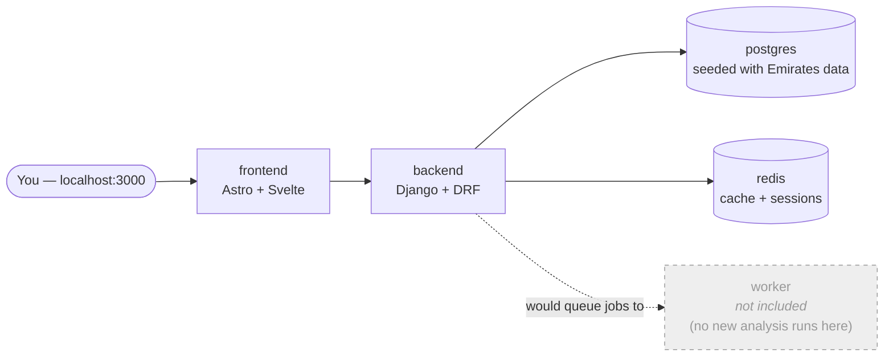

# Agora — demo bundle

This is a runnable local demonstration of Agora: the same Django and
Astro/Svelte application shown at
[agora.fridai.dev](https://agora.fridai.dev). It includes the completed
output of a public demo run using 1,643 Emirates reviews from Trustpilot
and Skytrax. The reviews have already been analysed for themes, sentiment
and per-topic stance, so you can browse the dashboard and human-review
workflow without running models locally. Agora has no customer deployments.
This is public demo data, not a client engagement.

**The AI pipeline code itself is not included in this bundle.** The image
you're pulling ships an inert stub in its place — you're looking at the
finished analysis, not a live re-run of it. See "What's excluded" below.

## Quickstart

Requires Docker (Compose v2) and about 3 GB free (image pulls + a small
Postgres volume). No API keys, no signup.

```bash
git clone https://github.com/fridai-dot-dev/agora-demo.git
cd agora-demo
docker compose up -d
```

First run takes several minutes, not a minute or two — most of it is pulling
the two images (~3.4 GB combined), then Postgres restores the seed data and
Django runs migrations. Measured clean-machine wall clock (`git clone` to a
working login, cold local image cache): **~4–6 minutes** on a normal
connection; a slower line or a host with none of the shared base layers
already cached may take longer. Watch it with `docker compose logs -f backend`
if you want to see progress; `docker compose ps` shows `healthy` once it's
ready. Subsequent restarts (`docker compose up -d` again, images already
local) take well under a minute.

Then open **http://localhost:3000** and sign in:

| Username | Password |
|---|---|
| `demo` | `agora-demo` |

That's it — three commands and a login. To stop it: `docker compose down`
(add `-v` to also drop the database volume and start fully fresh next time).

## Architecture



Four services boot: `frontend`, `backend`, `postgres`, `redis`. The greyed
`worker` box shows what a deployment running new analysis would add: an RQ
worker that runs the analysis pipeline as a background job. It is
intentionally absent here because this bundle contains no model API key or
pipeline code. The dashboard was analysed once for this public demo run,
and its result is stored in the bundle's seed data.

## What's excluded (and why)

- **The theme-analysis pipeline** (`consultation_analyser/themefinder/` in
  the real repo) — the prompts, LLM orchestration, and clustering logic that
  turn raw verbatims into themes. Replaced with an inert stub of the same
  module shape, so the app boots and serves already-computed results without
  being able to run new analysis.
- **Any API key or credential that could reach a live system** — no
  `GOOGLE_API_KEY`, no SMTP, no Sentry, no AWS. The `demo` login works
  because email-based MFA is disabled for this self-contained local demo;
  there is no outbound email.
- **A background worker.** See above — nothing here queues pipeline jobs.
- **Write access that matters.** You can click around the review UI, but
  there's no LLM behind it to act on anything you change, and there's no
  path out to a real inbox, bucket, or third-party API.

## Want the full thing?

This is a sample of Agora once analysis is complete. For a walkthrough of
the full analysis workflow see [agora.fridai.dev](https://agora.fridai.dev);
to talk about running it against your own data, get in touch.
